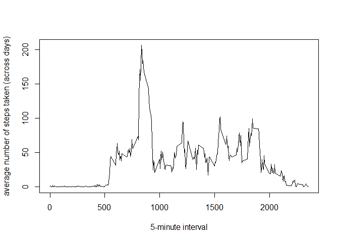
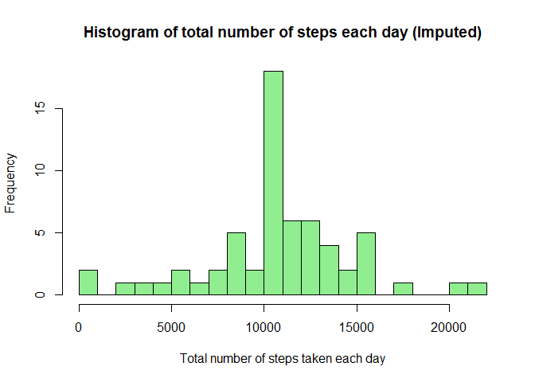
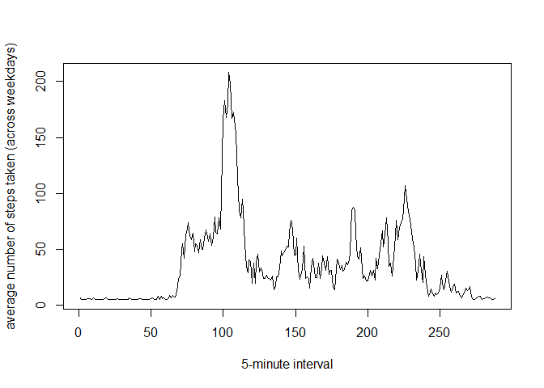
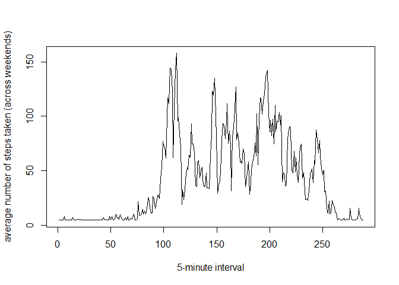

# Reproducible research - Assignment 1
Younes Bensadik  
12 juli 2017  


## 1. Preparing, loading and preprocessing the data 


#### Set variable for the .zip and .CSV file
#### IMPORTANT: you should set the value of the parameters to the path where files are stored.

```r
zip_file <- "./activity.zip"
csv_file <- "./activity.csv"
```
  
#### Check to see if there is a .CSV already. If not then unzip the .zip first to extract the .CSV file

```r
if(!file.exists(csv_file)) {unzip(zip_file)}
```
         
#### Now read the .CSV

```r
raw_activity_data <- read.table(csv_file, header=TRUE,  sep=",", na.strings = "NA")
```


## 2. What is mean total number of steps taken per day?
#### Calculate the total number of steps taken per day

```r
stepsPerDay <- tapply(raw_activity_data$steps, raw_activity_data$date, FUN=sum, na.rm=TRUE)
```

#### Make a histogram of the total number of steps taken each day

```r
hist(stepsPerDay, breaks = 30 , col = "lightgreen", main = "Histogram of total number of steps each day", xlab="Total number of steps taken each day")
```

<!-- -->

#### Calculate and report the mean and median of the total number of steps taken per day

```r
stepsPerDay_mean <-  mean(stepsPerDay, na.rm=TRUE)
stepsPerDay_median <- median(stepsPerDay, na.rm = TRUE)
```
* Mean of steps per day taken is: 9354.2295082
* Median of steps per day taken is:  10395

## 3. What is the average daily activity pattern?
#### Calculate average number of steps taken

```r
averageStepsTaken <- setNames(aggregate(x=list(steps=raw_activity_data$steps), by=list(raw_activity_data$interval), FUN=mean, na.rm=TRUE), c("interval", "steps"))
```

#### Make time series plot of the 5-minute interval and the average number of steps taken

```r
plot(averageStepsTaken, type = "l", xlab="5-minute interval", ylab="average number of steps taken (across days)")
```

<!-- -->

#### Which 5-minute interval, on average across all the days in the dataset, contains the maximum number of steps?
This 5-minute interval contains the maximum number of steps: **835**

## 4. Imputing missing values
#### Calculate and report the total number of missing values in the dataset (i.e. the total number of rows with NAs)

```r
# number of rows with NA's minus number of rows without NA's
missingValues <- nrow(raw_activity_data)- nrow(na.omit(raw_activity_data))
missingValues
```

```
## [1] 2304
```
The number of missing values is: **2304**


#### Devise a strategy for filling in all of the missing values in the dataset.
#### Create a new dataset that is equal to the original dataset but with the missing data filled in.

```r
library(Hmisc) ## library contains function "impute"
```

```
## Loading required package: lattice
```

```
## Loading required package: survival
```

```
## Loading required package: Formula
```

```
## Loading required package: ggplot2
```

```
## 
## Attaching package: 'Hmisc'
```

```
## The following objects are masked from 'package:base':
## 
##     format.pval, round.POSIXt, trunc.POSIXt, units
```

```r
activity_data_imputed <- raw_activity_data
activity_data_imputed$steps <- impute(raw_activity_data$steps, fun=mean)
```

#### Make a histogram of the total number of steps taken each day.

```r
stepsPerDayImputed <- tapply(activity_data_imputed$steps, activity_data_imputed$date, FUN=sum)
hist(stepsPerDayImputed, breaks = 30 , col = "lightgreen", main = "Histogram of total number of steps each day (Imputed)", xlab="Total number of steps taken each day")
```

<!-- -->

#### Calculate and report the mean and median total number of steps taken per day.

```r
stepsPerDayImputed_mean <-  mean(stepsPerDayImputed)
stepsPerDayImputed_median <- median(stepsPerDayImputed)
```

* Mean of steps per day taken (Imputed) is: 1.0766189\times 10^{4}
* Median of steps per day taken (Imputed) is:  1.0766189\times 10^{4}

#### The mean and median values are higher after imputing missing data.

## Are there differences in activity patterns between weekdays and weekends?

####Create a new factor variable in the dataset with two levels – “weekday” and “weekend” indicating whether a given date is a weekday or weekend day.

```r
# Deterimine if day is weekday or weekend and a column to store this
activity_data_imputed$weekday_or_weekend <-  ifelse(as.POSIXlt(activity_data_imputed$date)$wday %in% c(0,6), 'weekend', 'weekday')
```

#### Make a panel plot containing a time series plot (i.e. type = "l") of the 5-minute interval (x-axis) and the average number of steps taken, averaged across all weekday days or weekend days (y-axis). 

##### Calculate average number of steps taken

```r
averageStepsTakenImputed <- aggregate(steps ~ interval + weekday_or_weekend, activity_data_imputed, mean)
```

##### Make time series plot of the 5-minute interval and the average number of steps taken

```r
#subset data in data for weekdays and weekend
imputedStepsWeekdays <- subset(averageStepsTakenImputed, averageStepsTakenImputed$weekday_or_weekend == "weekday")
imputedStepsWeekends <- subset(averageStepsTakenImputed, averageStepsTakenImputed$weekday_or_weekend == "weekend")

# Now plot the steps taken in weekdays and weekends
plot(imputedStepsWeekdays$steps, type = "l", xlab="5-minute interval", ylab="average number of steps taken (across weekdays)")
```

<!-- -->

```r
# Now plot the steps taken in weekdays and weekends
plot(imputedStepsWeekends$steps, type = "l", xlab="5-minute interval", ylab="average number of steps taken (across weekends)")
```

<!-- -->


